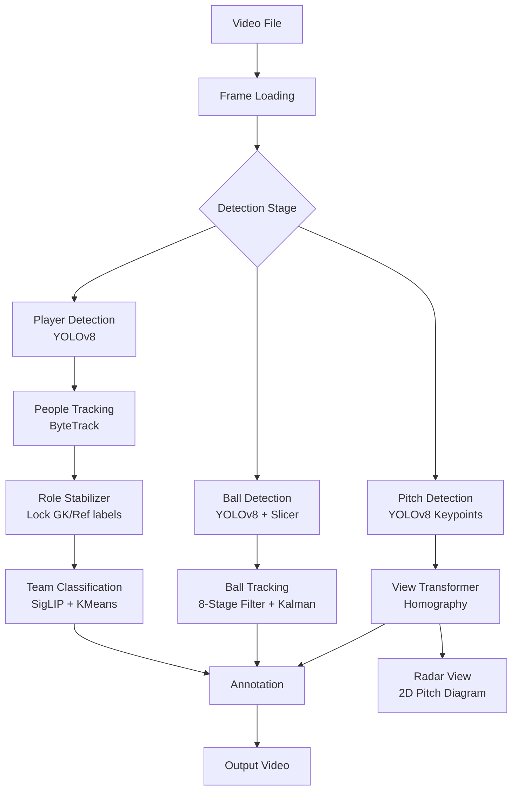

# Football Analysis Pipeline

A computer vision pipeline for analyzing broadcast football (soccer) footage. Automatically detects players, referees, goalkeepers, and the ball, tracks their movements across frames, classifies players by team, and transforms camera coordinates to pitch coordinates for tactical analysis.

## What This Project Does

Given a football video clip, this pipeline produces:

- **Annotated video** with bounding boxes around all detected players, referees, and goalkeepers
- **Team classification** - players color-coded by jersey (e.g., red vs blue)
- **Ball tracking** - ball position highlighted with trajectory smoothing
- **Unique IDs** - consistent identification across frames
- **Pitch keypoints** - 32 field landmarks for coordinate transformation
- **Tactical radar** - top-down 2D view of player positions on a pitch diagram

---

## How It Works

### Pipeline Flow



### Core Components

| Component | Technology | Purpose |
|-----------|------------|---------|
| **Player Detection** | YOLOv8 | Detect players, goalkeepers, referees |
| **Ball Detection** | YOLOv8 + Slicer | Tile-based detection for small ball |
| **Ball Filter** | 8-Stage Pipeline | Remove false positives, validate detections |
| **Ball Smoothing** | Kalman Filter | Predict trajectory, fill gaps |
| **People Tracking** | ByteTrack | Assign consistent IDs across frames |
| **Role Locking** | TrackStabiliser | Prevent GK/referee label flickering |
| **Team Assignment** | SigLIP + KMeans | Cluster by jersey color embeddings |
| **Pitch Keypoints** | YOLOv8 | Detect 32 field landmarks |
| **View Transform** | Homography | Map frame coords → pitch coords |
| **Radar View** | Pitch Annotators | Draw 2D tactical diagram |

---

## Pitch Detection & View Transformation

### How It Works

The pitch detection model identifies **32 keypoints** on the field (corners, penalty box edges, center circle points, etc.). These keypoints are used to compute a **homography matrix** that transforms pixel coordinates from the camera view to real-world pitch coordinates in centimeters.

```
Camera Frame (pixels)     Homography      Pitch Plane (cm)
                            Matrix
    ┌─────────────┐                        ┌─────────────┐
    │   ○ ○       │       ────────►        │         ○ ○ │
    │  ○    ○     │                        │        ○  ○ │
    │    ○        │                        │       ○     │
    └─────────────┘                        └─────────────┘
   Perspective view                         Top-down view
```

### Pitch Configuration

Standard FIFA dimensions (customizable in `pitch/config.py`):

| Dimension | Value | Description |
|-----------|-------|-------------|
| Length | 105m | Goal line to goal line |
| Width | 68m | Sideline to sideline |
| Penalty Box | 40.32m × 16.5m | 18-yard box |
| Goal Box | 18.32m × 5.5m | 6-yard box |
| Center Circle | 9.15m radius | Center of pitch |
| Penalty Spot | 11m from goal | Penalty kick distance |

### 32 Keypoint Layout

```
        ┌────────────────────────────────────────────────────────────┐
        │  1                         14                           25 │
        │  ○──────────────────────────○────────────────────────────○ │
        │  2 ┌────────────────────────────────────────────────┐ 26   │
        │  ○ │ 10                      │                   18 │ ○    │
        │  3 │  ○    ○ 11   15 ○       │       ○ 19    ○   │   27   │
        │  ○ │       │     31 ○───────●───○ 32    │        │   ○    │
        │    │  ○ 7  │               16 ○        │   23 ○  │        │
        │  4 │       ○ 12     ○ 9           22 ○ ○ 20      │   28   │
        │  ○ │  ○ 8  │                           │   24 ○  │   ○    │
        │  5 │  ○    ○ 13                     21 ○         │ 29     │
        │  ○ └────────────────────────────────────────────────┘ ○    │
        │  6                         17                           30 │
        │  ○──────────────────────────○────────────────────────────○ │
        └────────────────────────────────────────────────────────────┘
              Left Half                                    Right Half
```

### View Transformer

The `ViewTransformer` class (`pitch/view_transformer.py`) provides:

| Method | Description |
|--------|-------------|
| `transform_points(xy)` | Convert pixel coords to pitch coords |
| `transform_image(img)` | Warp entire frame to bird's-eye view |
| `matrix` | Access the 3×3 homography matrix |

### Radar Mode

The `radar` pipeline mode combines everything:
1. Detects players and ball
2. Detects pitch keypoints
3. Computes homography
4. Transforms all positions to pitch coordinates
5. Draws 2D tactical diagram with:
   - Team-colored player markers
   - Ball position
   - Optional Voronoi control regions
   - Optional movement paths

---

## Quick Start

### Google Colab (Recommended)

No installation required - runs in browser with free GPU.

[](https://colab.research.google.com/github/esharif20/Spatio-Temporal-GNN-Football-Analysis/blob/main/colab.ipynb)

### Local Installation

```bash
# Clone and setup
git clone https://github.com/esharif20/Spatio-Temporal-GNN-Football-Analysis.git
cd football_analysis
python3.11 -m venv venv && source venv/bin/activate
pip install -r requirements.txt
./src/setup.sh

# Run
./src/run.sh all Test6 --fresh
```

Output: `src/output_videos/Test6/Test6_ALL.mp4`

---

## Pipeline Modes

| Mode | Detection | Tracking | Teams | Ball | Pitch | Output |
|------|:---------:|:--------:|:-----:|:----:|:-----:|--------|
| `all` | ✓ | ✓ | ✓ | ✓ | - | Full annotated video |
| `team` | ✓ | ✓ | ✓ | - | - | Team-colored boxes |
| `track` | ✓ | ✓ | - | - | - | Boxes with IDs |
| `players` | ✓ | - | - | - | - | Detection only |
| `ball` | - | - | - | ✓ | - | Ball trajectory |
| `pitch` | - | - | - | - | ✓ | Keypoint visualization |
| `radar` | ✓ | ✓ | ✓ | ✓ | ✓ | 2D tactical view |

### Usage Examples

```bash
# Full analysis
./src/run.sh all my_match --fresh

# Ball tracking debug
./src/run.sh ball my_match --ball-conf 0.10

# Tactical radar view
./src/run.sh radar my_match --fresh

# Pitch keypoints only
./src/run.sh pitch my_match
```

---

## CLI Reference

### Core Options

| Option | Description |
|--------|-------------|
| `--fresh` | Ignore cache, reprocess everything |
| `--no-stub` | Don't read cache (still writes) |
| `--clear-stub` | Delete cache before running |

### Ball Tracking

| Option | Default | Description |
|--------|---------|-------------|
| `--ball-conf` | 0.15 | Detection confidence (lower = more detections) |
| `--ball-slice` | 640 | Tile size for slicer |
| `--ball-overlap` | 96 | Overlap between tiles |
| `--fast-ball` | off | Disable slicer (faster, less accurate) |
| `--ball-kalman` | off | Enable Kalman smoothing |
| `--no-ball-model` | off | Use multi-class model for ball |
| `--ball-mc-conf` | 0.35 | Multi-class ball confidence |

### Performance

| Option | Default | Description |
|--------|---------|-------------|
| `--det-batch` | auto | Detection batch size |
| `DEVICE=cuda` | auto | Force device (cuda/mps/cpu) |

---

## Project Structure

```
football_analysis/
├── README.md
├── requirements.txt
├── colab.ipynb                    # Google Colab notebook
├── colab_setup.sh                 # Colab environment setup
│
└── src/
    ├── main.py                    # Entry point
    ├── config.py                  # Global configuration
    ├── run.sh                     # CLI wrapper
    ├── setup.sh                   # Model/video downloader
    │
    ├── cli/                       # Command-line interface
    │   ├── args.py                # Argument definitions
    │   └── parsing.py             # Input validation
    │
    ├── pipeline/                  # Pipeline modes
    │   ├── base.py                # Shared utilities
    │   ├── players.py             # Detection only
    │   ├── ball.py                # Ball tracking
    │   ├── tracking.py            # Detection + tracking
    │   ├── team.py                # + team classification
    │   ├── full.py                # Complete pipeline
    │   ├── pitch.py               # Pitch keypoint detection
    │   └── radar.py               # Tactical 2D view
    │
    ├── trackers/                  # Detection & tracking
    │   ├── tracker.py             # Main orchestrator
    │   ├── detection.py           # YOLOv8 wrapper
    │   ├── people.py              # ByteTrack wrapper
    │   ├── ball_tracker.py        # Ball detection + Kalman
    │   ├── ball_config.py         # Ball tracking config
    │   ├── ball/
    │   │   └── filter.py          # 8-stage ball filter
    │   ├── annotator.py           # Drawing utilities
    │   └── track_stabiliser.py    # Role locking (GK/ref)
    │
    ├── team_assigner/             # Team classification
    │   └── team_assigner.py       # SigLIP + KMeans clustering
    │
    ├── pitch/                     # Pitch geometry & radar
    │   ├── config.py              # FIFA pitch dimensions, 32 keypoints
    │   ├── view_transformer.py    # Homography coordinate transform
    │   └── annotators.py          # Pitch drawing, Voronoi, radar overlay
    │
    ├── analytics/                 # Match analytics
    │   ├── ball_path.py           # Ball trajectory analysis
    │   ├── possession.py          # Possession statistics
    │   ├── kinematics.py          # Speed/distance metrics
    │   └── types.py               # Data types
    │
    ├── utils/                     # Shared utilities
    │   ├── video_utils.py         # FrameIterator, I/O
    │   ├── bbox_utils.py          # Bounding box helpers
    │   ├── cache.py               # Stub persistence
    │   ├── metrics.py             # Ball tracking metrics
    │   ├── drawing.py             # Drawing helpers
    │   ├── device.py              # GPU detection
    │   └── errors.py              # Custom exceptions
    │
    ├── models/                    # Pre-trained weights
    │   ├── player_detection.pt    # Players, GK, referees
    │   ├── ball_detection.pt      # Football/soccer ball
    │   └── pitch_detection.pt     # 32 pitch keypoints
    │
    ├── input_videos/              # Input clips
    ├── output_videos/             # Generated outputs
    └── stubs/                     # Cached detections
```

---

## Models

| Model | File | Detects | Classes |
|-------|------|---------|---------|
| Player Detection | `player_detection.pt` | Players, GK, refs | 4 classes |
| Ball Detection | `ball_detection.pt` | Football | 1 class |
| Pitch Detection | `pitch_detection.pt` | Field keypoints | 32 keypoints |

Models are YOLOv8 weights downloaded automatically by `./src/setup.sh`.

---

## Caching

Detection results are cached in `src/stubs/` to speed up re-runs:

```bash
# First run: full processing
./src/run.sh all Test6

# Second run: uses cached detections
./src/run.sh all Test6

# Force reprocessing
./src/run.sh all Test6 --fresh
```

---

## Troubleshooting

| Problem | Solution |
|---------|----------|
| "Video not found" | Check video is in `src/input_videos/` (without `.mp4`) |
| "Model not found" | Run `./src/setup.sh` |
| Out of memory | Use `--det-batch 8` or `DEVICE=cpu` |
| Ball not detected | Lower `--ball-conf 0.10` |
| Slow processing | Use GPU, or `--fast-ball` |
| Wrong team colors | Ensure clear jersey color distinction |
| Pitch keypoints fail | Need visible field markings |

---

## Development

```bash
# Run tests
pip install pytest pytest-cov
python -m pytest tests/ -v

# With coverage
python -m pytest tests/ --cov=src --cov-report=html
```

---

## Acknowledgments

- [Ultralytics YOLOv8](https://github.com/ultralytics/ultralytics) - Object detection
- [Roboflow Supervision](https://github.com/roboflow/supervision) - Tracking and annotation
- [ByteTrack](https://github.com/ifzhang/ByteTrack) - Multi-object tracking
- [SigLIP](https://github.com/google-research/big_vision) - Vision embeddings for team classification
